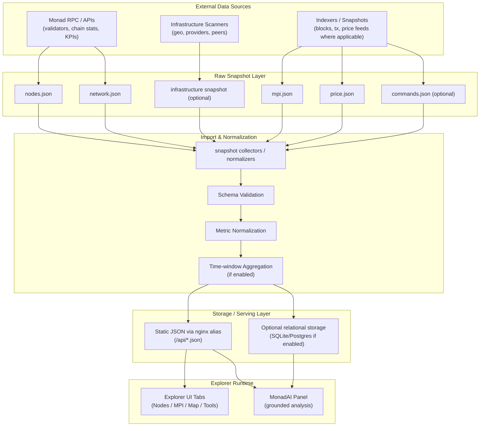

# Validexis Monad — Infrastructure & AI Explorer for the Monad Network 🚀

### Unified infrastructure explorer and analytical AI assistant for the Monad ecosystem  
Website: https://monad.validexis.com/  
Explorer data endpoints: `/api/nodes.json`, `/api/network.json`, `/api/mpi.json`, `/api/price.json`  
AI panel: **MonadAI** (embedded in the explorer UI)

---

## 🧩 Project Description

**Validexis Monad Explorer** is an open infrastructure and analytics initiative focused on providing **transparent, data-backed insights** into the **Monad network**.

The product combines a **network explorer**, a **structured snapshot pipeline**, and an **analytical AI layer (MonadAI)** that answers questions **strictly based on on-chain data and internal snapshots** used by the explorer.

The goal is to make the Monad network easier to understand, analyze, and operate — without relying on opaque dashboards or generic AI chatbots.

---

## 🧱 Core Components

The system consists of three tightly integrated layers:

### 1️⃣ Monad Explorer  
A web-based infrastructure explorer providing:

- Network-level statistics (validators, stake distribution, participation signals, chain-level KPIs)
- Validator set visibility, ranking and comparative context
- Network analytics / KPI dashboards (MPI section)
- Infrastructure and decentralization insights (geo / providers where available)
- Historical time-series snapshots (when present in the data pipeline)

---

### 2️⃣ MonadAI — Analytical Assistant  
**MonadAI** is an analytical assistant embedded directly inside the explorer UI — not a generic chatbot.

It can work with **Monad on-chain data and internal snapshots**, producing explanations and summaries that match what is displayed in the explorer.

Typical questions:

- “What is the current state of the Monad network?”
- “Show top validators by stake / concentration”
- “What changed in the latest snapshots?”
- “Is the network becoming more decentralized based on visible infra?”

All answers are generated **only from the explorer’s prepared context and snapshots** (no invented numbers).

---

### 3️⃣ Data Pipeline & Storage  
A structured ingestion layer that:

- Collects JSON snapshots from Monad APIs and infrastructure tooling
- Normalizes and aggregates metrics
- Stores or serves them as **clean analytical context** for the UI and MonadAI
- Keeps snapshot boundaries explicit (time windows, refresh cadence)

No hidden APIs, no hallucinated numbers — only verified snapshot context.

---

## ✨ Key Features

- 🔗 **Monad-native focus** — built for the Monad network  
- 📊 **Snapshot-based analytics** — clear time windows and explicit limitations  
- 🧠 **Hard-grounded AI (MonadAI)** — answers based only on explorer context / snapshots  
- 🧮 **Deterministic ranking logic** — ordering and comparisons are data-backed  
- 📈 **KPI / MPI analytics** — fast refresh + time-series where available  
- 🌍 **Infrastructure decentralization insights** — countries and providers (when visible)  
- 🧰 **Operational references** — structured commands / tooling knowledge base (optional)  
- 🛡 **Anti-hallucination design** — missing data is stated explicitly  
- 🧪 **Extensible architecture** — easy to add new sources and metrics cleanly  

---

## 👥 Usage Scenarios

| User Role | Typical Question / Goal | What the Explorer Provides |
|----------|--------------------------|----------------------------|
| **Validator / Node Operator** | *“How healthy is the current validator set?”* | Snapshot-based view of validators, participation signals, ranking and distribution context. |
| **Validator / Node Operator** | *“Am I competitive vs other validators?”* | Relative positioning, stake/uptime/infra context (depending on available metrics). |
| **Delegator / Community** | *“Who are the top validators and how concentrated is stake?”* | Deterministic top-N views, distribution indicators, decentralization commentary. |
| **Researcher / Ecosystem Team** | *“How is the network evolving?”* | KPI dashboards, time windows, change tracking between snapshots. |
| **Infrastructure / Decentralization Initiative** | *“Where are nodes hosted and are there concentration risks?”* | Country/provider aggregation and risk signaling (based on visible infra). |

The system is designed to **translate raw network data into clear, verifiable analytical answers** for different roles across the Monad ecosystem.

---

## 🧠 MonadAI Assistant Capabilities

MonadAI is an **analytical assistant**, not a generic LLM chat.

It follows strict rules:

- uses **only prepared explorer context / snapshots**
- never invents or estimates values
- explicitly states when data is missing
- explains metrics in plain language

### What it can do today ✅

- Provide **network overview snapshots** (based on available endpoints):
  - validator / node overview
  - chain KPIs exposed in `/api/network.json` and `/api/mpi.json`
  - price context if present in `/api/price.json`
  - latest blocks / transactions context when present in MPI snapshots

- Rank and summarize **validators / nodes**:
  - deterministic ordering based on available data fields
  - concentration / distribution commentary

- Explain **growth dynamics and trends** (when time-series snapshots exist):
  - KPI changes over time windows
  - snapshot-to-snapshot deltas

- Summarize **infrastructure distribution** (when present):
  - top countries
  - top hosting providers

---

## 🔍 Data Sources

The explorer currently uses:

- 🔌 **Monad network APIs / RPC / indexed snapshots** (depending on setup)
- 🗃 **JSON snapshot files served via the explorer API layer**
  - `/api/nodes.json`
  - `/api/network.json`
  - `/api/mpi.json`
  - `/api/price.json` (optional / when available)

All data is processed **before** reaching MonadAI and the UI.

---

## 🔄 Data Flow Overview



--- 

## 🧰 MCP & Tooling Layer (Optional)

The project can expose internal analytical context as callable tools (MCP-style).  
Example tools:

- `commands`  
  Returns structured CLI / RPC / operational references for the Monad network.

This layer is designed to be:

- reusable by other agents  
- callable by automation scripts  
- expandable with additional analytical tools  

---

## 🧱 Project Structure (Current)

This repo is split between **the explorer frontend** and **the data layer**.

Typical layout (frontend-focused):

```text
monadexplorer/
├── index.html                 # Explorer UI (tabs: Nodes / MPI / Map / Tools + MonadAI panel)
├── js/
│   ├── validators.js          # Nodes tab logic
│   ├── network.js             # Network stats logic
│   ├── mpi.js                 # MPI tab logic (mpi.json + price.json + nodes.json)
│   └── map.js                 # Map tab logic (globe.gl + infra distribution)
├── api/                       # Served via nginx alias (or generated by backend)
│   ├── nodes.json
│   ├── network.json
│   ├── mpi.json
│   └── price.json
└── README.md
```

## 🛠️ Getting Started (Local)

### 1️⃣ Requirements

- Linux environment (Ubuntu/Debian recommended)
- Any static HTTP server (nginx recommended)
- Optional: Python 3.10+ / Node tooling for snapshot generation scripts

---

### 2️⃣ Run locally (static)

Serve the directory that contains `index.html` and the `api/` folder:

- `index.html` must be able to fetch:
  - `/api/nodes.json`
  - `/api/network.json`
  - `/api/mpi.json`
  - `/api/price.json` (if enabled)

---

## 🛡 Design Principles

- No hallucinations — answers are snapshot-backed
- Explicit uncertainty — missing data is stated
- Deterministic analytics — ordering is data-driven
- Explainability first — numbers are explained, not dumped
- Public-good orientation — transparency over marketing

---

## 🔭 Roadmap

### ✅ Implemented

- Explorer UI (Nodes / MPI / Map / Tools)
- Snapshot-driven KPIs (/api/*.json)
- Embedded grounded analysis via MonadAI panel (UI layer)

### 🧪 Planned

- More historical windows and deeper time-series
- Advanced decentralization metrics
- More analytical tools and richer infra visibility
- Optional DB-backed agent runtime (if needed for larger context)

---

## 📄 License

This project is licensed under the **MIT License**.  
See the `LICENSE` file for details.
